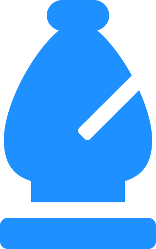

## Hello, I'm Muhammad

</img>

- 2nd year Computer Engineering student at Ryerson University.
- Currently learning about NextJS to replace my MERN workflow
- Originally started on Python where I made algorithms and a Discord Bot!

## Languages
> JavaScript, Java, Python, HTML, CSS, C, VHDL, Visual Basic, PBASIC

## Libraries/Frameworks
> NextJS, React, Express, NodeJS, MongoDB, Pygame, React Boostrap, Jquery

### Relevant Links:

